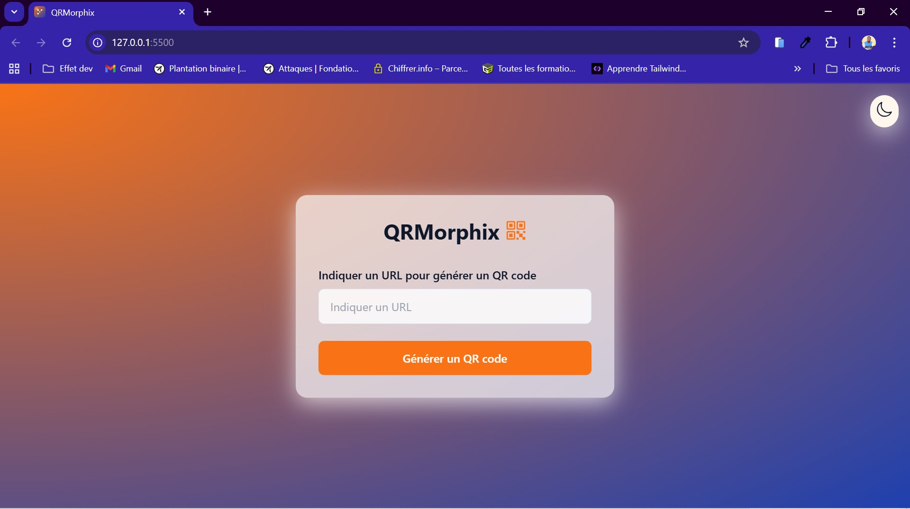
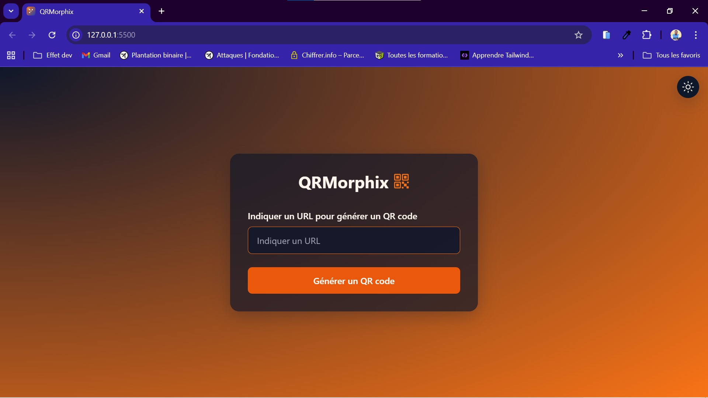

# � QRMorphix

## ✨ Caractéristiques

-   🎯 Génération instantanée de QR codes
-   🌓 Mode sombre/clair avec transition fluide
-   🎨 Design moderne avec effet glassmorphism
-   📱 Interface responsive
-   💾 Sauvegarde des préférences utilisateur
-   ⚡ Performances optimisées
-   🔍 Validation des URLs
-   🎭 Thèmes adaptables

## 🚀 Technologies Utilisées

-   HTML5
-   JavaScript (ES6+)
-   Tailwind CSS
-   IonIcons
-   API QR Code (QR Server)

## 🔧 Installation

1. Clonez le dépôt :
   \`\`\`bash
   git clone https://github.com/Denismaka/qrmorphix.git
   \`\`\`

2. Ouvrez le fichier \`index.html\` dans votre navigateur

## 🎮 Utilisation

1. Entrez l'URL souhaitée dans le champ de texte
2. Cliquez sur "Générer un QR code"
3. Le QR code s'affichera automatiquement
4. Utilisez le bouton en haut à droite pour basculer entre les modes clair/sombre

## 🎨 Personnalisation des Thèmes

Le projet utilise une palette de couleurs personnalisée via Tailwind CSS :

-   🟧 Primary : Orange (#f97316)
-   🟦 Secondary : Bleu (#1e40af)
-   💚 Accent : Vert (#34d399)
-   ❤️ Danger : Rouge (#dc2626)
-   💛 Warning : Jaune (#fbbf24)

## 📱 Captures d'écran

### Mode Clair

  

### Mode Sombre

  

## 🤝 Contribution

Les contributions sont les bienvenues ! N'hésitez pas à :

1. Fork le projet
2. Créer une branche (\`git checkout -b feature/AmazingFeature\`)
3. Commit vos changements (\`git commit -m 'Add some AmazingFeature'\`)
4. Push sur la branche (\`git push origin feature/AmazingFeature\`)
5. Ouvrir une Pull Request

## � Contact & Réseaux Sociaux

Pour toute question, collaboration ou devis :

### 📧 Coordonnées Directes

-   **Email** : makadenis370@gmail.com
-   **Téléphone** :
    -   +243 818 252 385
    -   +243 997 435 030

### 🌐 Réseaux Sociaux

## 📝 Licence

Ce projet est sous licence MIT - voir le fichier [LICENSE.md](LICENSE) pour plus de détails.

## ⭐ Soutien

Si vous aimez ce projet, pensez à lui donner une ⭐️ sur GitHub !

---

  Fait avec ❤️ par Denis Maka

